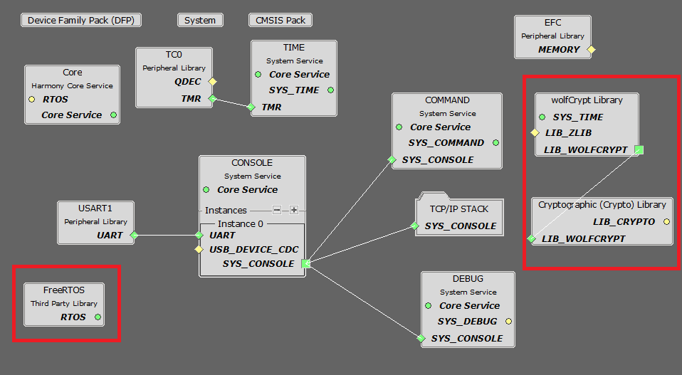
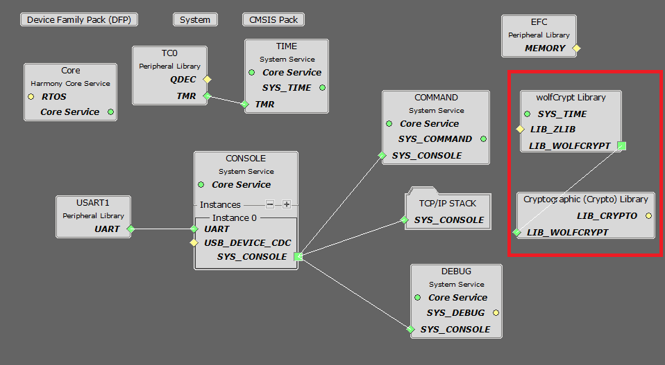
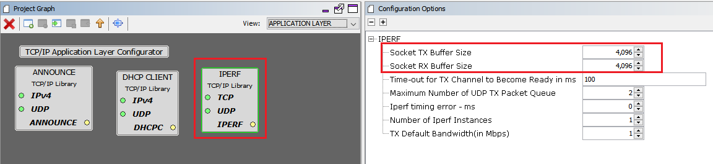
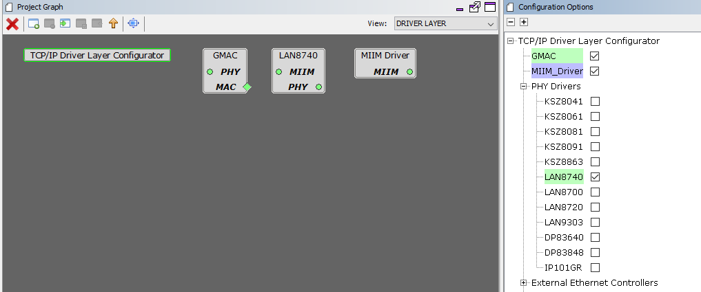

# TCP/IP IPERF Application MHC Configuration

The following Project Graph diagram shows the Harmony components included in the TCP Client demonstration application.

* MHC is launched by selecting **Tools > Embedded > MPLAB® Harmony 3 Configurator** from the MPLAB X IDE and after successful database migration , TCP/IP demo project is ready to be configured and regenerated.

    

* **TCP/IP root layer project graph**

  The root layer project shows that USART1 peripheral is selected to do read and write operation for TCP/IP commands. 

  This is the basic configuration with SYS_CONSOLE, SYS_DEBUG and SYS_COMMAND modules. These modules are required for TCP/IP command execution.

  

  **FreeRTOS** component is required for RTOS application. For bare-metal (non-RTOS) **FreeRTOS** component should not be selected.

  **NOTE** - The above diagram contains **FreeRTOS** component  and that is required for RTOS application. For bare-metal(non-RTOS) **FreeRTOS** component shouldn't be selected.

  

* **TCP/IP required application**

    TCP/IP demo use these application module components for this demo. 
    
    **Announce** module to discover the Microchip devices within a local network.
    
    **DHCP Client** module to discover the IPv4 address from the nearest DHCP Server. 
    
    **IPERF** module is used to run the network benchmark program.

    The default sizes of the Iperf RX and TX buffers are set to 4KB. The performance of a socket is highly dependent on the size of its buffers. So it's a good idea to use as large as possible buffers for the sockets that need high throughput. Bigger buffers will help obtain higher performance numbers.

    The other iperf parameters could be left with their default values.

    For a description of the parameters see the **Iperf Module** of the TCIP Library document.

    

* **TCPIP driver layer**

  **Internal ethernet driver(gmac)** is enabled with the external **LAN8740 PHY driver** library for SAME70 demonstartion. 

    

  For **SAM V71** demonstration , **LAN8061 PHY driver** ia selcted along with GMAC 
  **Internal ethernet driver**.

    

  The MIIM Driver supports asynchronous read/write and scan operations for accessing the external PHY registers and notification when MIIM operations have completed.

