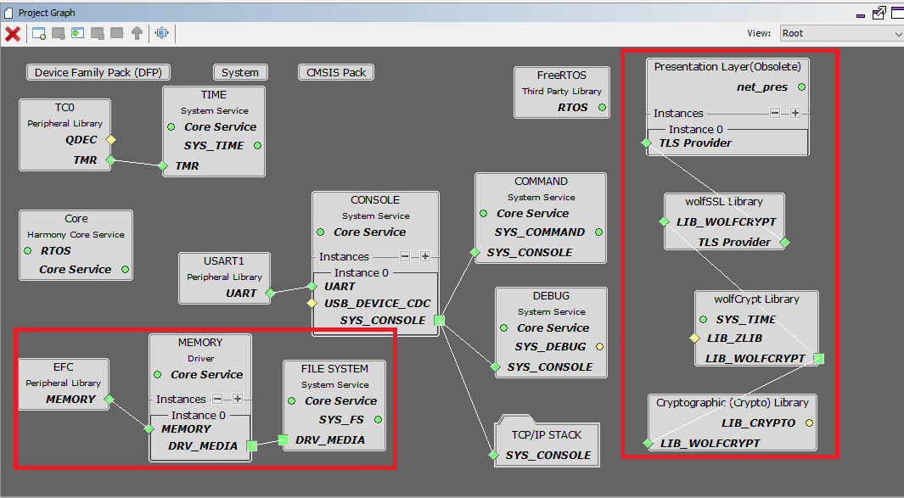
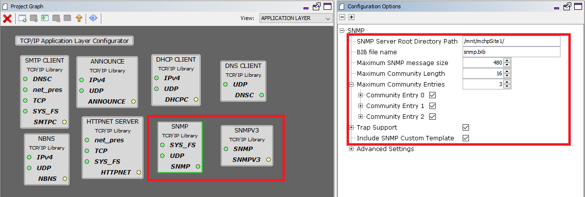

# TCP/IP SNMP NVM MPFS MHC Configuration

The following Project Graph diagram shows the Harmony components included in the application demonstration.

* MHC is launched by selecting **Tools > Embedded > MPLAB® Harmony 3 Configurator** from the MPLAB X IDE and after successful database migration , TCP/IP demo project is ready to be configured and regenerated.

    

* **TCP/IP Root Layer Project Graph**

  The root layer project shows that USART1 peripheral is selected to do read and write operation for TCP/IP commands.

  This is the basic configuration with SYS_CONSOLE, SYS_DEBUG and SYS_COMMAND modules. These modules are required for TCP/IP command execution.

  

  The file system component is required to select MPFS module. This is the below snapshot for the FS configuration.
  
  **FreeRTOS** component is required for RTOS application. For bare-metal (non-RTOS) **FreeRTOS** component should not be selected.

  

* **TCP/IP required application**

    TCP/IP demo use these application module components for this demo.
    
    **Announce** module to discover the Microchip devices within a local network.
    
    **DHCP Client** module to discover the IPv4 address from the nearest DHCP Server. 
    
    **HTTPNET** module is selected to run the web_server for the port number **80**. 
    
    **SNMP** and **SNMPv3** are an application layer protocols that facilitates the exchange of management information among network devices.     

    

    **Maximum SNMP Message Size** can be increased and the value should be multiple of 32 bytes for larger GET-Bulk response.

* **TCPIP driver layer**

  **Internal ethernet driver(gmac)** is enabled with the external **LAN8740 PHY driver** library for SAME70 demonstartion. 

    

  For **SAM V71** demonstration , **LAN8061 PHY driver** ia selcted along with GMAC 
  **Internal ethernet driver**.

    

  The MIIM Driver supports asynchronous read/write and scan operations for accessing the external PHY registers and notification when MIIM operations have completed.
