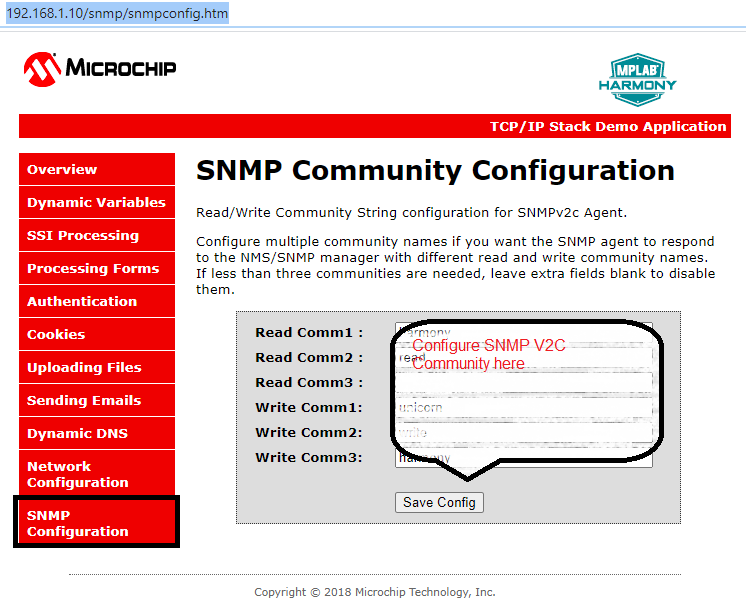

# TCP/IP SNMP NVM MPFS Running Application
The Non-Volatile Memory (NVM) Microchip Proprietary File System (MPFS) has the **snmp.bib** file along with other web page files stored in internal Flash and are accessed through the MPFS API.

## MPLAB X IDE Project
This table list the name and location of the MPLAB X IDE project folder for the demonstration.

|Project Name|  Target Device|  Target Development Board | Description  |
|:-------------:|:---------:|:---------:|:---------:|
|sam_e70_xult.X | ATSAME70Q21B | SAME70 Xplained Ultra + LAN8740 PHY Daughter board | Demonstrates the SNMP application on development board with ATSAME70Q21B device and LAN8740 PHY daughter board. This implementation is based on Bare Metal ( non-RTOS).  |
|sam_e70_xult_freertos.X | ATSAME70Q21B | SAME70 Xplained Ultra + LAN8740 PHY Daughter board | Demonstrates the SNMP application on development board with ATSAME70Q21B device and LAN8740 PHY daughter board. This implementation is based on Freertos.  |
|sam_v71_xult.X | ATSAMV71Q21B | SAMV71 Xplained Ultra | Demonstrates the SNMP application on development board with ATSAMV71Q21B device and KSZ8061 PHY daughter board. This implementation is based on Bare Metal (non-RTOS).  |
|sam_v71_xult_freertos.X | ATSAMV71Q21B | SAME70 Xplained Ultra | Demonstrates the SNMP application on development board with ATSAMV71Q21B device and KSZ8061 PHY daughter board. This implementation is based on Freertos.  |

## Running The Demonstration

1. Configure the Development Board as given  **[Configure Hardware](readme_hardware_configuration.md)**.

2. Make the demonstration setup as shown [Network Setup](../../readme.md).

3. Build and download the demonstration project on the target board.

4. If the board has a UART connection:

    1. A virtual COM port will be detected on the computer, when the USB cable is connected to USB-UART connector.

    2. Open a standard terminal application on the computer (like Hyper-terminal or Tera Term) and configure the virtual COM port.

    3. Set the serial baud rate to 115200 baud in the terminal application.

    4. See that the initialization prints on the serial port terminal.

    5. When the DHCP client is enabled in the demonstration, wait for the DHCP server to assign an IP address for the development board. This will be printed on the serial port terminal.

		* Alternatively: Use the Announce service or ping to get the IP address of the board.

        * Run **tcpip_discoverer.jar** to discover the IPv4 and IPv6 address for the board.
        
5. Execution :

    1. The SNMP and SNMPv3 server is hosted by the application.

    2. Open a SNMP manager (iREASONING SNMP manager is recommended) and Follow the steps given in **iREASONING Networks MIB Browser section** in the Third-Party help for complete details on using and configuring the application demonstration using the iREASONING SNMP Manager.

    3. SNMP MIB Browser -
    
        - Several SNMP MIB browsers are available. Users can also install a customized MIB browser specific to their application.

        - Verify SNMP Get, GetNext, GetBulk, Set requests and Get response operations .

        - For SNMP v2c , the Agent can be configured with three Read communities (E.g - "public", "read", " ") and three Write communities (e.g - "private","write","public").
        
           Also the SNMP v2c Community string can be Configured from the web browser.

           

        - For SNMP v3, the Agent is configured as per the following table:

            |Type|  USER 1|  USER 2|  USER 3|
            | ----- | ----- | ----- | ----- |  
            |USM User | microchip | SnmpAdmin | root  |
            |Security Level|  auth, priv|  auth, no priv|  no auth, no priv  |
            |Auth Algorithm|  MD5 |  SHA1 | N/A  |
            |Auth Password  |< As Per The Configuration >  | < As Per The Configuration >  | N/A  |
            |Privacy Algorithm | AES  |N/A | N/A |
            |Privacy Password | < As Per The Configuration > |  N/A | N/A  |

    	    The Microchip SNMP Stack supports both TRAP version 1 and TRAP version 2. The default trap output is a multi-varbind SNMPv3 TRAP version 2. Trap receiver setting of iReasoning to be selected and configured to visualize the trap output in the iReasoning MIB browser.
