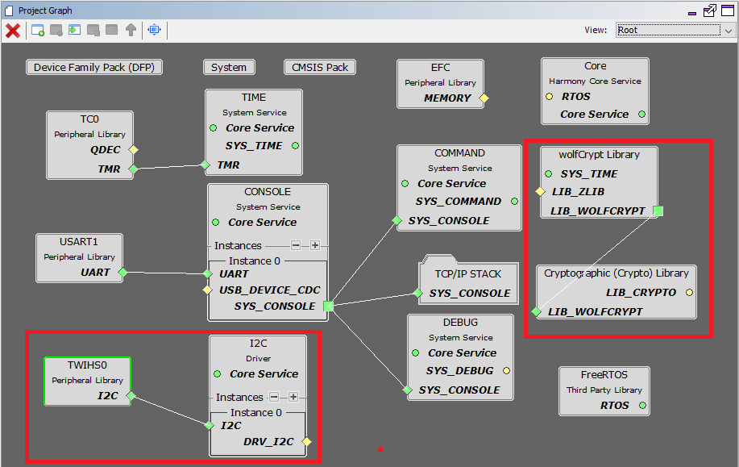

# TCP/IP TCP Client Using ATMAC MHC Configuration

The following Project Graph diagram shows the Harmony components included in the TCP Client demonstration application.

* MHC is launched by selecting **Tools > Embedded > MPLAB® Harmony 3 Configurator** from the MPLAB X IDE and after successful database migration , TCP/IP demo project is ready to be configured and regenerated.

    

* **TCP/IP root layer project graph**

  The root layer project shows that USART1 peripheral is selected to do read and write operation for TCP/IP commands.

  This is the basic configuration with SYS_CONSOLE, SYS_DEBUG and SYS_COMMAND modules. These modules are required for TCP/IP command execution.

  

  The Two-wire Interface (TWIHS) interconnects components on a unique two-wire bus. It is used with Two-wire Interface bus Serial EEPROM ( ATMAC ) , I²C-compatible device. 	
  
  TCP sockets calculate the ISN using the wolfSSL crypto library. 
  
* **TCP/IP required application**

  TCP/IP demo use these application module components for this demo. **Announce** module to discover the Microchip devices within a local network.
   
  **DHCP Client** module to discover the IPv4 address from the nearest DHCP Server.
  
  **DNS Client** provides DNS resolution capabilities to the stack. 
  

    

* **TCPIP driver layer**

  **Internal ethernet driver(gmac)** is enabled with the external **LAN8740 PHY driver** library for SAME70 demonstartion. 

    

  For **SAM V71** demonstration , **LAN8061 PHY driver** ia selcted along with GMAC 
  **Internal ethernet driver**.

    

  The MIIM Driver supports asynchronous read/write and scan operations for accessing the external PHY registers and notification when MIIM operations have completed.

