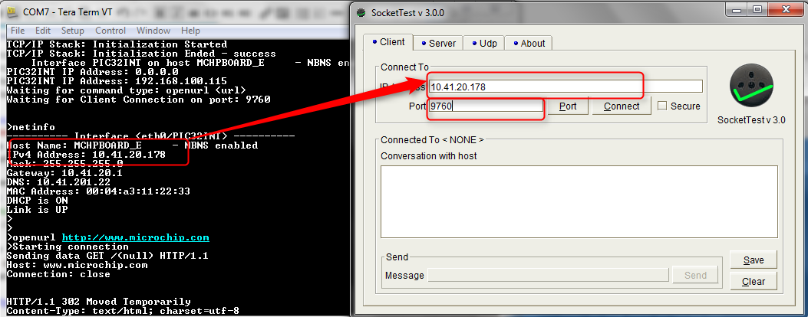

# TCP/IP TCP Server Running Application

## MPLAB X IDE Project
This table list the name and location of the MPLAB X IDE project folder for the demonstration.

|Project Name|  Target Device|  Target Development Board | Description  |
|:-------------:|:---------:|:---------:|:---------:|
|sam_e70_xult.X | ATSAME70Q21B | SAME70 Xplained Ultra + LAN8740 PHY Daughter board | Demonstrates the TCP Server on development board with ATSAME70Q21B device and LAN8740 PHY daughter board. This implementation is based on Bare Metal ( non-RTOS).  |
|sam_e70_xult_freertos.X | ATSAME70Q21B | SAME70 Xplained Ultra + LAN8740 PHY Daughter board | Demonstrates the TCP Server on development board with ATSAME70Q21B device and LAN8740 PHY daughter board. This implementation is based on Freertos.  |
|sam_v71_xult.X | ATSAMV71Q21B | SAMV71 Xplained Ultra | Demonstrates the TCP Server on development board with ATSAMV71Q21B device and KSZ8061 PHY daughter board. This implementation is based on Bare Metal (non-RTOS).  |
|sam_v71_xult_freertos.X | ATSAMV71Q21B | SAME70 Xplained Ultra | Demonstrates the TCP Server on development board with ATSAMV71Q21B device and KSZ8061 PHY daughter board. This implementation is based on Freertos.  |

## IAR Embeded Workbench IDE Project

This table lists the name and location of the IAR IDE project folder for the demonstration. 

|Project Name|  Target Device|  Target Development Board | Description  |
|:-------------:|:---------:|:---------:|:---------:|
|sam_e70_xult_iar.IAR | ATSAME70Q21B | SAME70 Xplained Ultra + LAN8740 PHY Daughter board | Demonstrates the Berkeley TCP Server on development board with ATSAME70Q21B device and LAN8740 PHY daughter board. This implementation is based on Bare Metal ( non-RTOS).  |
|sam_v71_xult_iar.IAR | ATSAMV71Q21B | SAMV71 Xplained Ultra | Demonstrates the Berkeley TCP Server on development board with ATSAMV71Q21B device and KSZ8061 PHY daughter board. This implementation is based on Bare Metal (non-RTOS).  |

## Running The Demonstration

1. Configure the Development Board as given  **[Configure Hardware](readme_hardware_configuration.md)**.

2. Make the demonstration setup as shown [Network Setup](../../readme.md).

3. Build and download the demonstration project on the target board.

4. If the board has a UART connection:

    1. A virtual COM port will be detected on the computer, when the USB cable is connected to USB-UART connector.

    2. Open a standard terminal application on the computer (like Hyper-terminal or Tera Term) and configure the virtual COM port.

    3. Set the serial baud rate to 115200 baud in the terminal application.

    4. See that the initialization prints on the serial port terminal.

    5. When the DHCP client is enabled in the demonstration, wait for the DHCP server to assign an IP address for the development board. This will be printed on the serial port terminal.

		* Alternatively: Use the Announce service or ping to get the IP address of the board.

        * Run **tcpip_discoverer.jar** to discover the IPv4 and IPv6 address for the board.
        
5. Execution :

    1. As soon as a valid IP address is assigned through the DHCP to the demonstration, it is ready to accept a TCP/IP connection on port 9760.

    2. Send a TCP packet to the IP address of the hardware board using port 9760 from any TCP Client application running on the computer.

    3. The TCP Server demonstration running on the evaluation kit will echo back everything it receives along the connection.

    4. For TCP Server test, the TCP Client application is required to run on the computer (SocketTest, Packet Sender etc). In this demonstration, we use the program, SocketTest (http://sockettest.sourceforge.net/). This demonstration is tested with **SocketTest v3.0**.
        * Open the **SocketTest** software and set the configuration as shown in the following figure.

            

        *  Press the Connect button on the **SocketTest** software after setting the configuration. The serial terminal indicates that the connection has been established.
        * Type any message in the message box of the **SocketTest** program, and press the Send button. The Server running on the development board will echo back the message to the **SocketTest** program.

            
