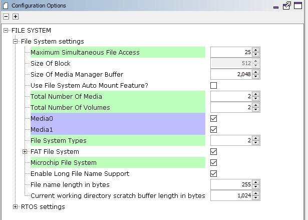
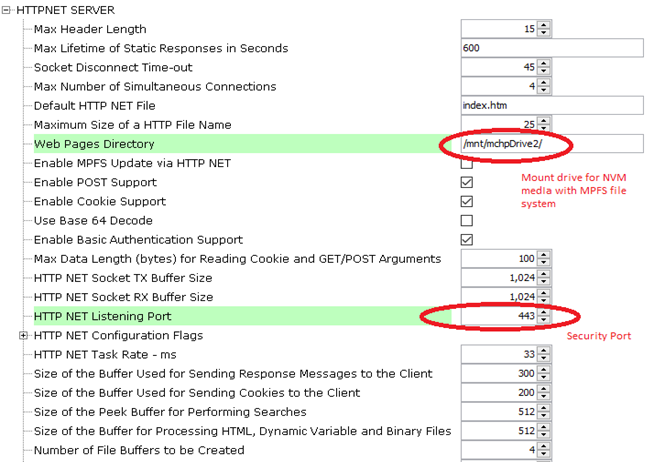
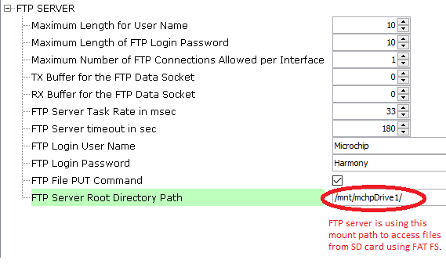

# TCP/IP WEB-NET & FTP Server MHC Configuration

The following Project Graph diagram shows the Harmony components included in the application demonstration.

* MHC is launched by selecting **Tools > Embedded > MPLAB® Harmony 3 Configurator** from the MPLAB X IDE and after successful database migration , TCP/IP demo project is ready to be configured and regenerated.

    

* **TCP/IP Root Layer Project Graph**

  The root layer project shows that UART2 peripheral is selected to do read and write operation for TCP/IP commands.

  This is the basic configuration with SYS_CONSOLE, SYS_DEBUG and SYS_COMMAND modules. These modules are required for TCP/IP command execution.

  TCP/IP application with both MPFS and FAT FS access. The below root project graph depicts the use of more than FS by TCP/IP stack. Also HTTP Server use Wolfssl library to support secured web server on port. 443

  

  **WolfSSL** component is selected for secure connection which supports TLS v1.3 and **WolfSSL-Crypto** component is  selected for MD5 and SHA authentication.

  
  
  Both MPFS and FAT File System Configuration -

  
  
  **FreeRTOS** component is required for RTOS application. For bare-metal (non-RTOS) **FreeRTOS** component should not be selected.

  TCP sockets calculate the ISN using the wolfSSL crypto library. 

* **TCP/IP Required Application**

    TCP/IP demo use these application module components for this demo. 
    
    **Announce** module to discover the Microchip devices within a local network.

    **DHCP Client** module to discover the IPv4 address from the nearest DHCP Server.
    
    **HTTPNET** module is selected to run the web_server for the secured port number **443**.

    **FTP SERVER** an application layer protocol that facilitates uploading of files to, and downloading of files from, an embedded device.     

    

    * HTTPNET server with Web directory Mount path and Security port number configuration:

      

      Http Server module use the NVM mount path with MPFS files system. Also HTTP server module use the secured port number 443.

    * FTP server use the FAT FS to access files from SDCARD media.

      

* **TCPIP Driver Layer**

  **Internal ethernet driver(gmac)** is enabled with the external **LAN8740 PHY driver** library for SAME70 demonstartion. 

  

  For **SAM V71** demonstration , **LAN8061 PHY driver** ia selcted along with GMAC **Internal ethernet driver**.

  

  The MIIM Driver supports asynchronous read/write and scan operations for accessing the external PHY registers and notification when MIIM operations have completed.
