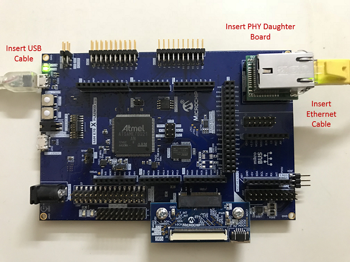
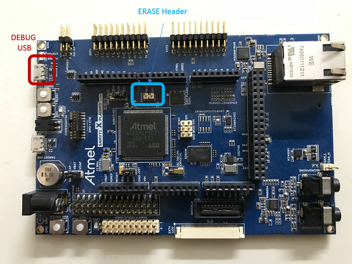

# TCP/IP Web Server NVM MPFS Hardware Configuration

This is the section describes the hardware configuration for ATSAM E70/V71 Xplained Ultra Evaluation Kit and one can be used for the respective application demonstration.

1. This section describes the required default hardware configuration use SAM E70 Xplained Ultra Evaluation Kit

    * Ensure ERASE jumper is Open.
    * Open the J805 Jumper

    * Refer to the SAM E70/V71 Ethernet Starter Kit [User Guide](http://ww1.microchip.com/downloads/en/DeviceDoc/SAME70_Xplained_Ultra_Evaluation_User's%20Guide_DS70005389B.pdf)

      

    * Insert the LAN8740 PHY daughter board on the ETHERNET PHY MODULE header.
    * Connect the micro USB cable from the computer to the DEBUG USB connector on the SAM E70 Xplained Ultra Evaluation Kit
    * Establish a connection between the router/switch with the SAM E70 Xplained Ultra Evaluation Kit through the RJ45 connector

      

2. This section describes the required default hardware configuration use SAM V71 Xplained Ultra Evaluation Kit
    * No hardware related configuration or jumper setting changes are necessary
    * Ensure ERASE jumper is Open
    * Refer to the SAM E70/V71 Ethernet Starter Kit [User Guide](http://ww1.microchip.com/downloads/en/DeviceDoc/Atmel-42408-SAMV71-Xplained-Ultra_User-Guide.pdf)

      

    * Connect the micro USB cable from the computer to the DEBUG USB connector on the SAM V71 Xplained Ultra Evaluation Kit

    * Establish a connection between the router/switch with the SAM V71 Xplained Ultra Evaluation Kit through the RJ45 connector

      
