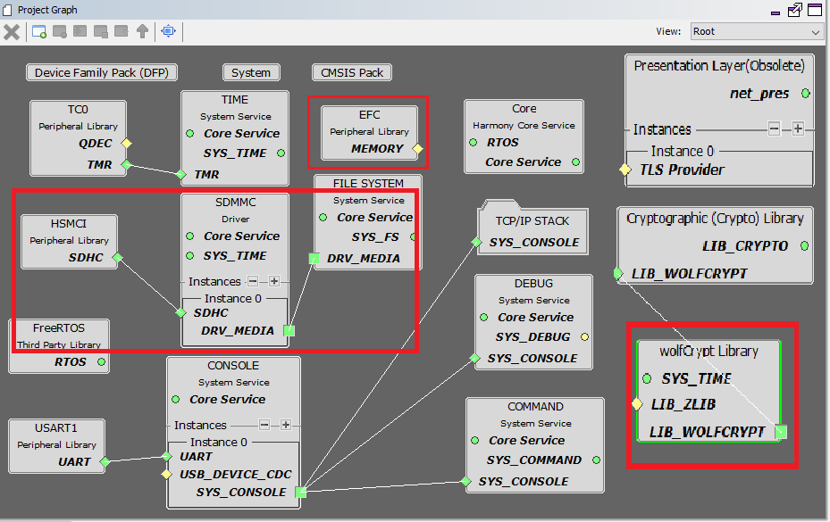

# TCP/IP Web Server SDMMC FATFS MHC Configuration

The following Project Graph diagram shows the Harmony components included in the application demonstration.

* MHC is launched by selecting **Tools > Embedded > MPLAB® Harmony 3 Configurator** from the MPLAB X IDE and after successful database migration , TCP/IP demo project is ready to be configured and regenerated.

    

* **TCP/IP Root Layer Project Graph**

    HSMCI ( High Speed Multimedia Card Interface ) peripheral supports Multimedia card communication. SD multimedia memory card ( SDMMC ) driver provides abstraction to communicate with SD/eMMC card through the HSMCI peripheral library interface. The TCP/IP application use FAT file system with SDMMC driver to read/write to an SD card. 

    

    TCP sockets calculate the ISN using the wolfSSL crypto library. 
    
    **Wolfssl crypto** module enabled with MD5,SHA authentication  and AES encryption/decryption privacy protocol are enabled. Wolfssl library used a open a secured socket.

    **FreeRTOS** component is required for RTOS application. For bare-metal (non-RTOS) **FreeRTOS** component should not be selected.

    The FAT file system is selected for this application to read and write from the SDHC( sdcard ) module. This is the below snapshot for the FAT FS configuration.

    

* **TCP/IP Required Application**

    TCP/IP demo use these application module components for this demo.
    
    **Announce** module to discover the Microchip devices within a local network.
    
    **DHCP Client** module to discover the IPv4 address from the nearest DHCP Server. 
    
    **HTTP** module is selected to run the web_server for the port number **80**.     

    

* **TCPIP Driver Layer**

  **Internal ethernet driver(gmac)** is enabled with the external **LAN8740 PHY driver** library for SAME70 demonstartion. 

  

  For **SAM V71** demonstration , **LAN8061 PHY driver** ia selcted along with GMAC **Internal ethernet driver**.

  

  The MIIM Driver supports asynchronous read/write and scan operations for accessing the external PHY registers and notification when MIIM operations have completed.
