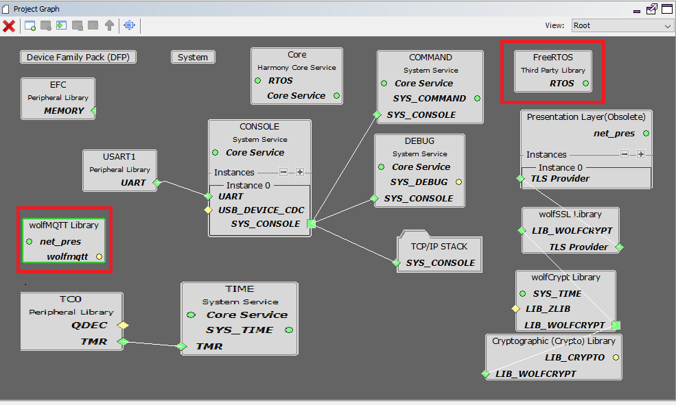
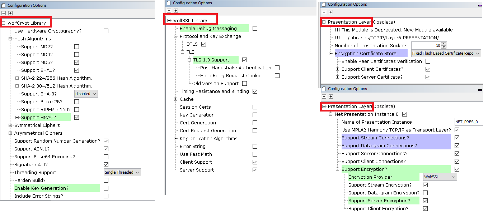
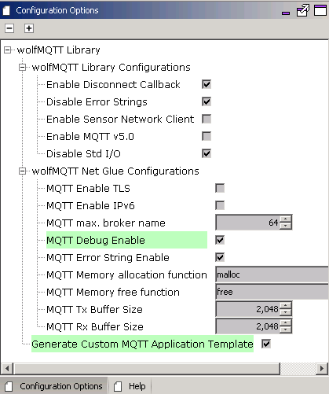

# TCP/IP TCP WolfSSL Client MHC Configuration

The following Project Graph diagram shows the Harmony components included in the TCP Client demonstration application.

* MHC is launched by selecting **Tools > Embedded > MPLAB® Harmony 3 Configurator** from the MPLAB X IDE and after successful database migration , TCP/IP demo project is ready to be configured and regenerated.

    

* **TCP/IP Root Layer Project Graph**

    The root layer project shows that USART1 peripheral is selected to do read and write operation for TCP/IP commands.

    This is the basic configuration with SYS_CONSOLE, SYS_DEBUG and SYS_COMMAND modules. These modules are required for TCP/IP command execution.

    

    **NOTE:-**  
    **FreeRTOS** component is required for RTOS application. For bare-metal (non-RTOS) **FreeRTOS** component should not be selected.

    The below snapshot provides the details of the wolfssl_crypto, wolfSSL and presentation layer configuration.

    

    The configuration options for the wolfMQTT are the standard ones supported by wolfMQTT (see wolfMQTT site).
    Note that the project has already selected the 3rd party wolfMQTT and wolfSSL libraries (for supporting encrypted connections).

    The NET_PRES layer is also needed because the Harmony wolfMQTT NET glue layer uses the NET_PRES to handle the connections to the broker.

    Use the github repositories for wolfMQTT and wolfSSL.

    To configure the wolfMQTT and the wolfMWQTT NET glue layer, select the "wolfMQTT Library" module:

    

    The configuration options for the wolfMQTT NET glue allow the application to:

    * force TLS mode
    * enable IPv6 operation
    * set the maximum length of the MQTT broker
    * enable the NET glue debug and debug strings
    * set the allocation functions
    * set the MQTT TX and RX buffer sizes
    * generate the custom MQTT application template:
    * the files app_mqtt_task.c, app_mqtt_task.h and app_mqtt_commands.c will be added to the project

* **TCP/IP Required Application**

  TCP/IP demo use these application module components for this demo. 
  
  **Announce** module to discover the Microchip devices within a local network.
  
  **DHCP Client** module to discover the IPv4 address from the nearest DHCP Server.
  
  **DNS Client** provides DNS resolution capabilities to the stack.  During these components selection, the required transport and network modules are also selected.

    

* **TCPIP Driver Layer**

  **Internal ethernet driver(gmac)** is enabled with the external **LAN8740 PHY driver** library for SAME70 demonstartion. 

    

  For **SAM V71** demonstration , **LAN8061 PHY driver** ia selcted along with GMAC 
  **Internal ethernet driver**.

    

  The MIIM Driver supports asynchronous read/write and scan operations for accessing the external PHY registers and notification when MIIM operations have completed.

