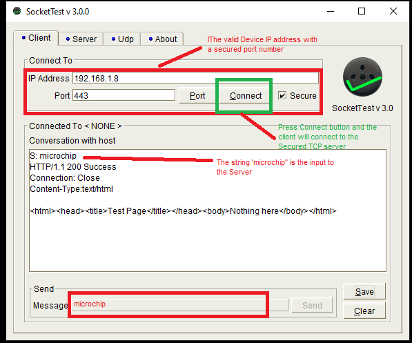
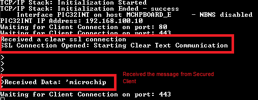

# TCP/IP WolfSSL TCP Server

This configuration demonstrates creating a simple Internet Web server, that operates with clear text \(TCP Port 80\), and with encrypted text \(TCP Port 443\). If IPv6 is enabled than the demonstration also serves both types of connections on IPv6. The Web server only serves one page with the text 'Nothing Here' to all Web clients.

This demonstration uses the NET\_PRES layer for encrypted communication through an external service provider for TLS support.

**TCP/IP TCP WolfSSL Server MHC Configuration**

The following Project Graph diagram shows the Harmony components included in the TCP Client demonstration application.

-   MHC is launched by selecting **Tools \> Embedded \> MPLAB® Harmony 3 Configurator** from the MPLAB X IDE and after successful database migration , TCP/IP demo project is ready to be configured and regenerated.

    

-   **TCP/IP Root Layer Project Graph**

    The root layer project shows that USART1 peripheral is selected to do read and write operation for TCP/IP commands.

    This is the basic configuration with SYS\_CONSOLE, SYS\_DEBUG and SYS\_COMMAND modules. These modules are required for TCP/IP command execution.

    

    **NOTE:-****FreeRTOS** component is required for RTOS application. For bare-metal \(non-RTOS\) **FreeRTOS** component should not be selected.

    The below snapshot provides the details of the wolfssl\_crypto, wolfSSL and presentation layer configuration.

    

    TCP sockets calculate the ISN using the wolfSSL crypto library.

-   **TCP/IP Required Application**

    TCP/IP demo use these application module components for this demo.

    **Announce** module to discover the Microchip devices within a local network.

    **DHCP Client** module to discover the IPv4 address from the nearest DHCP Server.

    **DNS Client** provides DNS resolution capabilities to the stack. During these components selection, the required transport and network modules are also selected.

    

-   **TCPIP Driver Layer**

    **Internal ethernet driver\(gmac\)** is enabled with the external **LAN8740 PHY driver** library for SAME70 demonstartion.

    

    For **SAM V71** demonstration , **LAN8061 PHY driver** ia selcted along with GMAC **Internal ethernet driver**.

    

    The MIIM Driver supports asynchronous read/write and scan operations for accessing the external PHY registers and notification when MIIM operations have completed.

**TCP/IP TCP WolfSSL Server Hardware Configuration**

This section describes the hardware configuration for ATSAM E70 Xplained Ultra Evaluation Kit and one can be used for the respective application demonstration.

1.  This section describes the required default hardware configuration use SAM E70 Xplained Ultra Evaluation Kit

    -   Ensure ERASE jumper is Open.

    -   Open the J805 Jumper

    -   Refer to the SAM E70/V71 Ethernet Starter Kit [User Guide](http://ww1.microchip.com/downloads/en/DeviceDoc/SAME70_Xplained_Ultra_Evaluation_User's%20Guide_DS70005389B.pdf)

        

    -   Insert the LAN8740 PHY daughter board on the ETHERNET PHY MODULE header.

    -   Connect the micro USB cable from the computer to the DEBUG USB connector on the SAM E70 Xplained Ultra Evaluation Kit

    -   Establish a connection between the router/switch with the SAM E70 Xplained Ultra Evaluation Kit through the RJ45 connector

        

**TCP/IP WolfSSL TCP Server Running Application**

This table list the name and location of the MPLAB X IDE project folder for the demonstration.

|Project Name|Target Device|Target Development Board|Description|
|------------|-------------|------------------------|-----------|
|sam\_e70\_xult.X|ATSAME70Q21B|SAME70 Xplained Ultra + LAN8740 PHY Daughter board|Demonstrates the wolfSSL TCP Server on a development board with ATSAME70Q21B device and LAN8740 PHY daughter board. This is a bare-metal \(non-RTOS\) implementation. WolfSSL Hardware crypto enabled|
|sam\_e70\_xult\_freertos.X|ATSAME70Q21B|SAME70 Xplained Ultra + LAN8740 PHY Daughter board|Demonstrates the wolfSSL TCP Server on development board with ATSAME70Q21B device and LAN8740 PHY daughter board. This implementation is based on Freertos.|
|sam\_e70\_xult\_sw.X|ATSAME70Q21B|SAME70 Xplained Ultra + LAN8740 PHY Daughter board|Demonstrates the wolfSSL TCP Server on a development board with ATSAME70Q21B device with and LAN8740 PHY daughter board. This is a bare-metal \(non-RTOS\) implementation. WolfSSL Software crypto enabled|

**Running Demonstration Steps**

1.  Build and download the demonstration project on the target board.

2.  If the board has a UART connection:

    1.  A virtual COM port will be detected on the computer, when the USB cable is connected to USB-UART connector.

    2.  Open a standard terminal application on the computer \(like Hyper-terminal or Tera Term\) and configure the virtual COM port.

    3.  Set the serial baud rate to 115200 baud in the terminal application.

    4.  See that the initialization prints on the serial port terminal.

    5.  When the DHCP client is enabled in the demonstration, wait for the DHCP server to assign an IP address for the development board. This will be printed on the serial port terminal.

        -   Alternatively: Use the Announce service or ping to get the IP address of the board.

        -   Run **tcpip\_discoverer.jar** to discover the IPv4 and IPv6 address for the board.

3.  Execution :

    1.  As soon as a valid IP address is assigned through the DHCP to the demonstration, it is ready to accept a TCP/IP connection on non-secured port **80** or secured port **443**.

        

    2.  Send a TCP packet to the IP address of the hardware board using port **443** from any TCP Client application running on the computer.

    3.  The TCP Server demonstration running on the evaluation kit will echo back everything it receives along the connection.

    4.  For TCP Server test, the TCP Client application is required to run on the computer \(SocketTest, Packet Sender etc\). In this demonstration, we use the program, SocketTest \(http://sockettest.sourceforge.net/\). This demonstration is tested with **SocketTest v3.0**.

        -   Open the **SocketTest** software and set the configuration as shown in the following figure.

            

        -   Press the Connect button on the **SocketTest** software after setting the configuration. The serial terminal indicates that the connection has been established.

        -   Type any message in the message box of the **SocketTest** program, and press the Send button. The Server running on the development board will echo back the message to the **SocketTest** program.

            

**Parent topic:**[MPLAB® Harmony 3 TCP/IP Application for SAM E70/V71 Family](../../docs/GUID-1B418433-257B-421A-B251-3443D46108F8.md)

