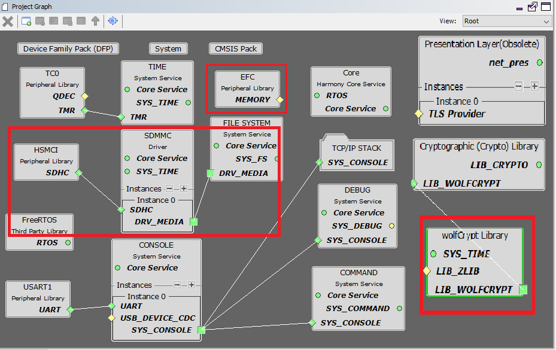
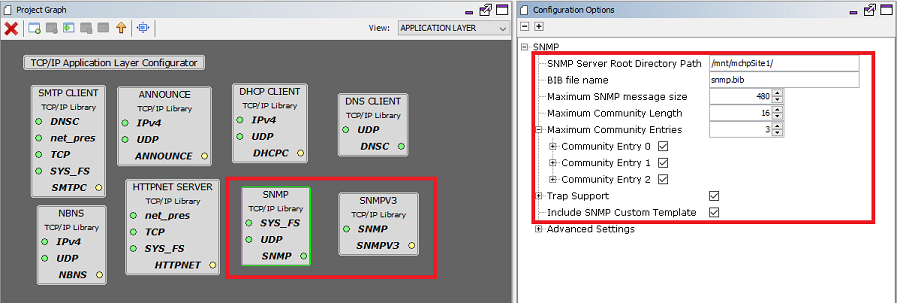
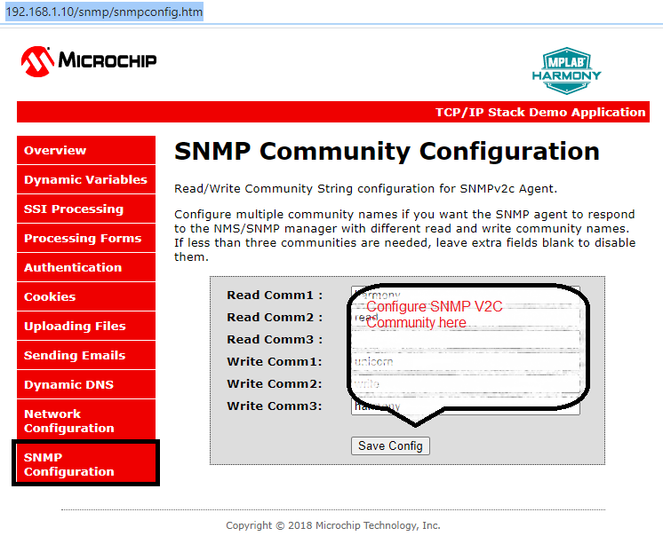

# TCP/IP SNMP SDMMC Application

The Microchip SNMP Server is a multi-lingual implementation, which supports SNMPv1, V2c, and V3 server features simultaneously. The SNMP Server is implemented to address the requirements of embedded applications and works with both IPv4 and IPv6 addresses.

**TCP/IP SNMP SDMMC FATFS MHC Configuration**

The following Project Graph diagram shows the Harmony components included in the application demonstration.

-   MHC is launched by selecting **Tools \> Embedded \> MPLAB® Harmony 3 Configurator** from the MPLAB X IDE and after successful database migration , TCP/IP demo project is ready to be configured and regenerated.

    

-   **TCP/IP Root Layer Project Graph**

    HSMCI \( High Speed Multimedia Card Interface \) peripheral supports Multimedia card communication. SD multimedia memory card \( SDMMC \) driver provides abstraction to communicate with SD/eMMC card through the HSMCI peripheral library interface. The TCP/IP application use FAT file system with SDMMC driver to read/write to an SD card.

    

    Wolfssl crypto module enabled with MD5,SHA authentication and AES encryption/decryption privacy protocol are enabled. Wolfssl library configured with open secured socket.

    

    **FreeRTOS** component is required for RTOS application. For bare-metal \(non-RTOS\) **FreeRTOS** component should not be selected.

    The FAT file system is selected for this application to read and write from the SDHC\( sdcard \) module. This is the below snapshot for the FAT FS configuration.

    

-   **TCP/IP Required Application**

    TCP/IP demo use these application module components for this demo.

    **Announce** module to discover the Microchip devices within a local network.

    **DHCP Client** module to discover the IPv4 address from the nearest DHCP Server.

    **HTTPNET** module is selected to run the web\_server for the port number **443**.

    **SNMP** and **SNMPv3** are an application layer protocols that facilitates the exchange of management information among network devices.

    

    **Maximum SNMP Message Size** can be increased and the value should be multiple of 32 bytes for larger GET-Bulk response.

-   **TCPIP Driver Layer**

    **Internal ethernet driver\(gmac\)** is enabled with the external **LAN8740 PHY driver** library for SAME70 demonstartion.

    

    For **SAM V71** demonstration , **LAN8061 PHY driver** ia selcted along with GMAC **Internal ethernet driver**.

    

    The MIIM Driver supports asynchronous read/write and scan operations for accessing the external PHY registers and notification when MIIM operations have completed.

**TCP/IP SNMP SDMMC FATFS Hardware Configuration**

This is the section describes the hardware configuration for ATSAM E70/V71 Xplained Ultra Evaluation Kit and one can be used for the respective application demonstration.

1.  This section describes the required default hardware configuration use SAM E70 Xplained Ultra Evaluation Kit

    -   Ensure ERASE jumper is Open.

    -   Open the J805 Jumper

    -   Refer to the SAM E70/V71 Ethernet Starter Kit [User Guide](http://ww1.microchip.com/downloads/en/DeviceDoc/SAME70_Xplained_Ultra_Evaluation_User's%20Guide_DS70005389B.pdf)

        

    -   Insert the LAN8740 PHY daughter board on the ETHERNET PHY MODULE header.

    -   Connect the micro USB cable from the computer to the DEBUG USB connector on the SAM E70 Xplained Ultra Evaluation Kit

    -   Establish a connection between the router/switch with the SAM E70 Xplained Ultra Evaluation Kit through the RJ45 connector

        

2.  This section describes the required default hardware configuration use SAM V71 Xplained Ultra Evaluation Kit

    -   No hardware related configuration or jumper setting changes are necessary

    -   Ensure ERASE jumper is Open

    -   Refer to the SAM E70/V71 Ethernet Starter Kit [User Guide](http://ww1.microchip.com/downloads/en/DeviceDoc/Atmel-42408-SAMV71-Xplained-Ultra_User-Guide.pdf)

        

    -   Connect the micro USB cable from the computer to the DEBUG USB connector on the SAM V71 Xplained Ultra Evaluation Kit

    -   Establish a connection between the router/switch with the SAM V71 Xplained Ultra Evaluation Kit through the RJ45 connector

        

**TCP/IP SNMP SDMMC FATFS Application**

This SNMP application opens a file named **snmp.bib** in the root directory of the SD card and reads its content into memory. Also web pages stored in an external SD card and is accessed through a FAT FS API.

This table list the name and location of the MPLAB X IDE project folder for the demonstration.

|Project Name|Target Device|Target Development Board|Description|
|------------|-------------|------------------------|-----------|
|sam\_e70\_xult.X|ATSAME70Q21B|SAME70 Xplained Ultra + LAN8740 PHY Daughter board|Demonstrates the SNMPv3 SDCARD application on development board with ATSAME70Q21B device and LAN8740 PHY daughter board. This implementation is based on Bare Metal \( non-RTOS\).|
|sam\_e70\_xult\_freertos.X|ATSAME70Q21B|SAME70 Xplained Ultra + LAN8740 PHY Daughter board|Demonstrates the SNMPv3 SDCARD application on development board with ATSAME70Q21B device and LAN8740 PHY daughter board. This implementation is based on Freertos.|
|sam\_v71\_xult.X|ATSAMV71Q21B|SAMV71 Xplained Ultra|Demonstrates the SNMPv3 SDCARD application on development board with ATSAMV71Q21B device and KSZ8061 PHY daughter board. This implementation is based on Bare Metal \(non-RTOS\).|
|sam\_v71\_xult\_freertos.X|ATSAMV71Q21B|SAME70 Xplained Ultra|Demonstrates the SNMPv3 SDCARD application on development board with ATSAMV71Q21B device and KSZ8061 PHY daughter board. This implementation is based on Freertos.|

1.  Ensure a SD card is formatted and loaded with the snmp.bib file along with the web pages provided within the< install-dir \>/net/apps/snmpv3\_sdcard\_fatfs/firmware/src/web\_pages directory.

**Running Demonstration Steps**

1.  Build and download the demonstration project on the target board.

2.  If the board has a UART connection:

    1.  A virtual COM port will be detected on the computer, when the USB cable is connected to USB-UART connector.

    2.  Open a standard terminal application on the computer \(like Hyper-terminal or Tera Term\) and configure the virtual COM port.

    3.  Set the serial baud rate to 115200 baud in the terminal application.

    4.  See that the initialization prints on the serial port terminal.

    5.  When the DHCP client is enabled in the demonstration, wait for the DHCP server to assign an IP address for the development board. This will be printed on the serial port terminal.

        -   Alternatively: Use the Announce service or ping to get the IP address of the board.

        -   Run **tcpip\_discoverer.jar** to discover the IPv4 and IPv6 address for the board.

3.  SNMP Demo Execution:

    1.  The SNMP and SNMPv3 server is hosted by the application.

    2.  Open a SNMP manager \(iREASONING SNMP manager is recommended\) and Follow the steps given in **iREASONING Networks MIB Browser section** in the Third-Party help for complete details on using and configuring the application demonstration using the iREASONING SNMP Manager.

    3.  SNMP MIB Browser -

        -   Several SNMP MIB browsers are available. Users can also install a customized MIB browser specific to their application.

        -   Verify SNMP Get, GetNext, GetBulk, Set requests and Get response operations .

        -   For SNMP v2c , the Agent can be configured with three Read communities \(E.g - "public", "read", " "\) and three Write communities \(e.g - "private","write","public"\).

            Also the SNMP v2c Community string can be Configured from the web browser.

            

        -   For SNMP v3, the Agent is configured as per the following table:

            |Type|USER 1|USER 2|USER 3|
            |----|------|------|------|
            |USM User|microchip|SnmpAdmin|root|
            |Security Level|auth, priv|auth, no priv|no auth, no priv|
            |Auth Algorithm|MD5|SHA1|N/A|
            |Auth Password|< As Per The Configuration \>|< As Per The Configuration \>|N/A|
            |Privacy Algorithm|AES|N/A|N/A|
            |Privacy Password|< As Per The Configuration \>|N/A|N/A|

            The Microchip SNMP Stack supports both TRAP version 1 and TRAP version 2. The default trap output is a multi-varbind SNMPv3 TRAP version 2. Trap receiver setting of iReasoning to be selected and configured to visualize the trap output in the iReasoning MIB browser.

**Parent topic:**[MPLAB® Harmony 3 TCP/IP Application for SAM E70/V71 Family](GUID-1B418433-257B-421A-B251-3443D46108F8.md)

