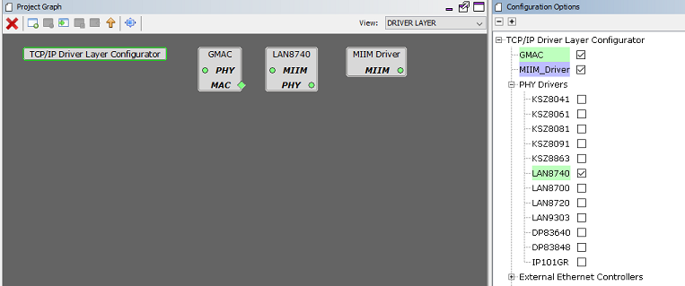
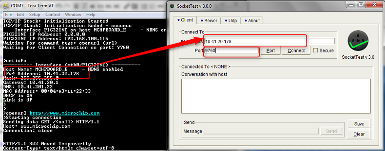
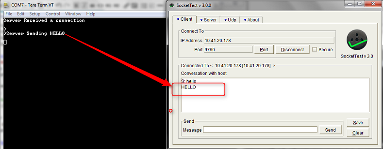

# TCP/IP TCP Client Server

The TCP Client Server configuration demonstrates creating a network client and server that uses the MPLAB Harmony TCP API. This demonstration is a combination of the TCP/IP Client and TCP/IP Server application.

**TCP/IP TCP Client Server MHC Configuration**

The following Project Graph diagram shows the Harmony components included in the TCP Client demonstration application.

-   MHC is launched by selecting **Tools \> Embedded \> MPLAB® Harmony 3 Configurator** from the MPLAB X IDE and after successful database migration , TCP/IP demo project is ready to be configured and regenerated.

    

-   **TCP/IP Root Layer Project Graph**

    The root layer project shows that USART1 peripheral is selected to do read and write operation for TCP/IP commands.

    This is the basic configuration with SYS\_CONSOLE, SYS\_DEBUG and SYS\_COMMAND modules. These modules are required for TCP/IP command execution.

    

    **FreeRTOS** component is required for RTOS application. For bare-metal \(non-RTOS\) **FreeRTOS** component should not be selected.

    **NOTE** - The above diagram contains **FreeRTOS** component and that is required for RTOS application. For bare-metal\(non-RTOS\) **FreeRTOS** component shouldn't be selected.

    

    TCP sockets calculate the ISN using the wolfSSL crypto library.

-   **TCP/IP Required Application**

    TCP/IP demo use these application module components for this demo.

    **Announce** module to discover the Microchip devices within a local network.

    **DHCP Client** module to discover the IPv4 address from the nearest DHCP Server.

    **DNS Client** provides DNS resolution capabilities to the stack.

    

-   **TCPIP Driver Layer**

    **Internal ethernet driver\(gmac\)** is enabled with the external **LAN8740 PHY driver** library for SAME70 demonstartion.

    

    For **SAM V71** demonstration , **LAN8061 PHY driver** ia selcted along with GMAC **Internal ethernet driver**.

    

    The MIIM Driver supports asynchronous read/write and scan operations for accessing the external PHY registers and notification when MIIM operations have completed.

**TCP/IP TCP Client Server Hardware Configuration**

This section describes the hardware configuration for ATSAM E70/V71 Xplained Ultra Evaluation Kit and one can be used for the respective application demonstration.

1.  This section describes the required default hardware configuration use SAM E70 Xplained Ultra Evaluation Kit

    -   Ensure ERASE jumper is Open.

    -   Open the J805 Jumper

    -   Refer to the SAM E70/V71 Ethernet Starter Kit [User Guide](http://ww1.microchip.com/downloads/en/DeviceDoc/SAME70_Xplained_Ultra_Evaluation_User's%20Guide_DS70005389B.pdf)

        

    -   Insert the LAN8740 PHY daughter board on the ETHERNET PHY MODULE header.

    -   Connect the micro USB cable from the computer to the DEBUG USB connector on the SAM E70 Xplained Ultra Evaluation Kit

    -   Establish a connection between the router/switch with the SAM E70 Xplained Ultra Evaluation Kit through the RJ45 connector

        

2.  This section describes the required default hardware configuration use SAM V71 Xplained Ultra Evaluation Kit

    -   No hardware related configuration or jumper setting changes are necessary

    -   Ensure ERASE jumper is Open

    -   Refer to the SAM E70/V71 Ethernet Starter Kit [User Guide](http://ww1.microchip.com/downloads/en/DeviceDoc/Atmel-42408-SAMV71-Xplained-Ultra_User-Guide.pdf)

        

    -   Connect the micro USB cable from the computer to the DEBUG USB connector on the SAM V71 Xplained Ultra Evaluation Kit

    -   Establish a connection between the router/switch with the SAM V71 Xplained Ultra Evaluation Kit through the RJ45 connector

        

**TCP/IP TCP Client Server Running Application**

This table list the name and location of the MPLAB X IDE project folder for the demonstration.

|Project Name|Target Device|Target Development Board|Description|
|------------|-------------|------------------------|-----------|
|sam\_e70\_xult.X|ATSAME70Q21B|SAME70 Xplained Ultra + LAN8740 PHY Daughter board|Demonstrates the TCP/IP TCP Client Server on development board with ATSAME70Q21B device and LAN8740 PHY daughter board. This implementation is based on baremetal.|
|sam\_e70\_xult\_freertos.X|ATSAME70Q21B|SAME70 Xplained Ultra + LAN8740 PHY Daughter board|Demonstrates the TCP/IP TCP Client Server on development board with ATSAME70Q21B device and LAN8740 PHY daughter board. This implementation is based on FreeRTOS.|
|sam\_v71\_xult.X|ATSAMV71Q21B|SAMV71 Xplained Ultra|Demonstrates the TCP/IP TCP Client Server on development board with ATSAMV71Q21B device and KSZ8061 PHY daughter board. This implementation is based on baremetal.|
|sam\_v71\_xult\_freertos.X|ATSAMV71Q21B|SAME71 Xplained Ultra|Demonstrates the TCP/IP TCP Client Server on development board with ATSAMV71Q21B device and KSZ8061 PHY daughter board. This implementation is based on Freertos.|

**Running Demonstration Steps**

1.  Build and download the demonstration project on the target board.

2.  If the board has a UART connection:

    1.  A virtual COM port will be detected on the computer, when the USB cable is connected to USB-UART connector.

    2.  Open a standard terminal application on the computer \(like Hyper-terminal or Tera Term\) and configure the virtual COM port.

    3.  Set the serial baud rate to 115200 baud in the terminal application.

    4.  See that the initialization prints on the serial port terminal.

    5.  When the DHCP client is enabled in the demonstration, wait for the DHCP server to assign an IP address for the development board. This will be printed on the serial port terminal.

        -   Alternatively: Use the Announce service or ping to get the IP address of the board.

        -   Run **tcpip\_discoverer.jar** to discover the IPv4 and IPv6 address for the board.

3.  Execution :

    1.  After the successful broad bring up, the console output becomes

        

    2.  For TCP Client test, input the following command from the serial port: **openurl < url \>** - The < url \> argument must be a fully formed URL; for instance, http://www.microchip.com/.

        For this above URL , the DNS module will make a DNS query. Then it will open a connection to the requested URL and perform a simple HTTP GET command.

        The response received from the server will be printed on the terminal application through the serial port.

        The expected output -

        

    3.  For TCP Server test, the TCP Client application is required to run on the computer \(SocketTest, Packet Sender etc\). In this demonstration, we use the program, SocketTest \(http://sockettest.sourceforge.net/\). This demonstration is tested with **SocketTest v3.0**.

        -   Open the **SocketTest** software and set the configuration as shown in the following figure.

            

        -   Press the Connect button on the **SocketTest** software after setting the configuration. The serial terminal indicates that the connection has been established.

        -   Type any message in the message box of the **SocketTest** program, and press the Send button. The Server running on the development board will echo back the message to the **SocketTest** program.

            

**Parent topic:**[MPLAB® Harmony 3 TCP/IP Application for SAM E70/V71 Family](GUID-1B418433-257B-421A-B251-3443D46108F8.md)

