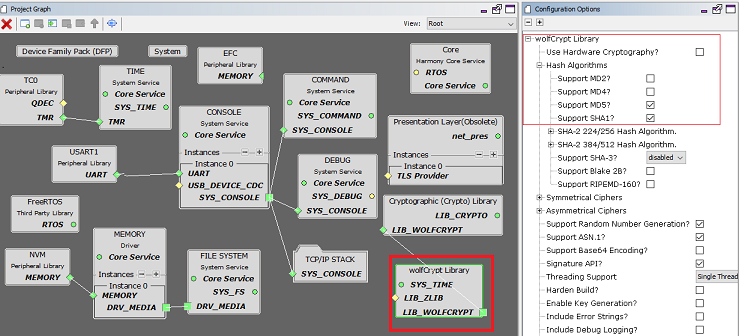
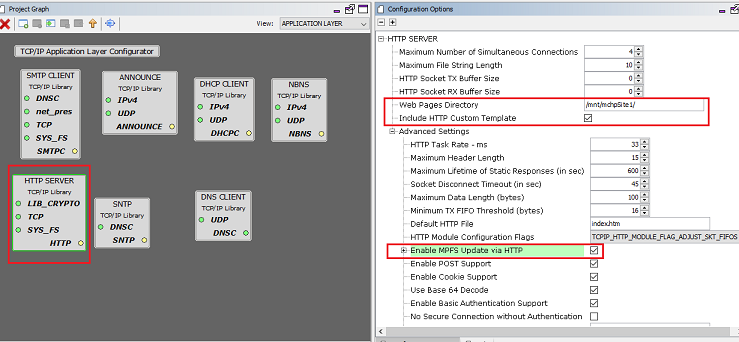
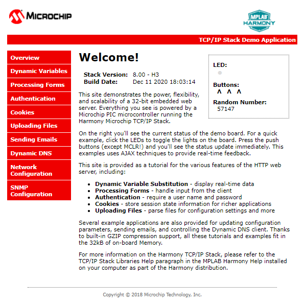

# TCP/IP Web Server NVM MPFS Application

The Web Server Non-volatile Memory \(NVM\) MPFS configuration demonstrates creating an HTTP web server on a Microchip evaluation board. The Non-Volatile Memory \(NVM\) Microchip Proprietary File System \(MPFS\) is used for storing the web pages in the internal Flash.

**TCP/IP Web Server NVM MPFS MHC Configuration**

The following Project Graph diagram shows the Harmony components included in the application demonstration.

-   MHC is launched by selecting **Tools \> Embedded \> MPLAB® Harmony 3 Configurator** from the MPLAB X IDE and after successful database migration , TCP/IP demo project is ready to be configured and regenerated.

    

-   **TCP/IP Root Layer Project Graph**

    The root layer project shows that UART2 peripheral is selected to do read and write operation for TCP/IP commands.

    This is the basic configuration with SYS\_CONSOLE, SYS\_DEBUG and SYS\_COMMAND modules. These modules are required for TCP/IP command execution.

    

    The file system component is required to select MPFS module. This is the below snapshot for the FS configuration.

    

    **FreeRTOS** component is required for RTOS application. For bare-metal \(non-RTOS\) **FreeRTOS** component should not be selected.

    TCP sockets calculate the ISN using the wolfSSL crypto library.

-   **TCP/IP Required Application**

    TCP/IP demo use these application module components for this demo.

    **Announce** module to discover the Microchip devices within a local network.

    **DHCP Client** module to discover the IPv4 address from the nearest DHCP Server.

    **HTTP** module is selected to run the web\_server for the port number **80**.

    

    By default **Enable MPFS upload via HTTP** is selected. This is helpful When external EEPROM or serial Flash is used for storage, the option to upload the newly created image to the board is available.

-   **TCPIP Driver Layer**

    **Internal ethernet driver\(gmac\)** is enabled with the external **LAN8740 PHY driver** library for SAME70 demonstartion.

    

    For **SAM V71** demonstration , **LAN8061 PHY driver** ia selcted along with GMAC **Internal ethernet driver**.

    

    The MIIM Driver supports asynchronous read/write and scan operations for accessing the external PHY registers and notification when MIIM operations have completed.

**TCP/IP Web Server NVM MPFS Hardware Configuration**

This is the section describes the hardware configuration for ATSAM E70/V71 Xplained Ultra Evaluation Kit and one can be used for the respective application demonstration.

1.  This section describes the required default hardware configuration use SAM E70 Xplained Ultra Evaluation Kit

    -   Ensure ERASE jumper is Open.

    -   Open the J805 Jumper

    -   Refer to the SAM E70/V71 Ethernet Starter Kit [User Guide](http://ww1.microchip.com/downloads/en/DeviceDoc/SAME70_Xplained_Ultra_Evaluation_User's%20Guide_DS70005389B.pdf)

        

    -   Insert the LAN8740 PHY daughter board on the ETHERNET PHY MODULE header.

    -   Connect the micro USB cable from the computer to the DEBUG USB connector on the SAM E70 Xplained Ultra Evaluation Kit

    -   Establish a connection between the router/switch with the SAM E70 Xplained Ultra Evaluation Kit through the RJ45 connector

        

2.  This section describes the required default hardware configuration use SAM V71 Xplained Ultra Evaluation Kit

    -   No hardware related configuration or jumper setting changes are necessary

    -   Ensure ERASE jumper is Open

    -   Refer to the SAM E70/V71 Ethernet Starter Kit [User Guide](http://ww1.microchip.com/downloads/en/DeviceDoc/Atmel-42408-SAMV71-Xplained-Ultra_User-Guide.pdf)

        

    -   Connect the micro USB cable from the computer to the DEBUG USB connector on the SAM V71 Xplained Ultra Evaluation Kit

    -   Establish a connection between the router/switch with the SAM V71 Xplained Ultra Evaluation Kit through the RJ45 connector

        

**TCP/IP Web Server NVM MPFS Running Application**

The HTTP net server module uses Microchip Proprietary File System \(MPFS\) to read web pages from the Non-Volatile Memory \(NVM\). The Non-Volatile Memory \(NVM\) is one of the memory media is used to store the web server pages.

This table list the name and location of the MPLAB X IDE project folder for the demonstration.

|Project Name|Target Device|Target Development Board|Description|
|------------|-------------|------------------------|-----------|
|sam\_e70\_xult.X|ATSAME70Q21B|SAME70 Xplained Ultra + LAN8740 PHY Daughter board|Demonstrates the TCP/IP Web Server on a development board with ATSAME70Q21B device and LAN8740 PHY daughter board. This is a bare-metal \(non-RTOS\) implementation.|
|sam\_e70\_xult\_freertos.X|ATSAME70Q21B|SAME70 Xplained Ultra + LAN8740 PHY Daughter board|Demonstrates the TCP/IP Web Server on development board with ATSAME70Q21B device and LAN8740 PHY daughter board. This implementation is based on FreeRTOS.|
|sam\_v71\_xult.X|ATSAMV71Q21B|SAMV71 Xplained Ultra|Demonstrates the web server NVM MPFS on development board with ATSAMV71Q21B device and KSZ8061 PHY daughter board. This implementation is based on Bare Metal \(non-RTOS\).|
|sam\_v71\_xult\_freertos.X|ATSAMV71Q21B|SAMV71 Xplained Ultra|Demonstrates the web server NVM MPFS on development board with ATSAMV71Q21B device and KSZ8061 PHY daughter board. This implementation is based on Freertos.|

**Running Demonstration Steps**

1.  Build and download the demonstration project on the target board.

2.  If the board has a UART connection:

    1.  A virtual COM port will be detected on the computer, when the USB cable is connected to USB-UART connector.

    2.  Open a standard terminal application on the computer \(like Hyper-terminal or Tera Term\) and configure the virtual COM port.

    3.  Set the serial baud rate to 115200 baud in the terminal application.

    4.  See that the initialization prints on the serial port terminal.

    5.  When the DHCP client is enabled in the demonstration, wait for the DHCP server to assign an IP address for the development board. This will be printed on the serial port terminal.

        -   Alternatively: Use the Announce service or ping to get the IP address of the board.

        -   Run **tcpip\_discoverer.jar** to discover the IPv4 and IPv6 address for the board.

3.  HTTP Server Output -

    An HTTP server is hosted by the demonstration application. Open\_a web browser and direct it to the board running the HTTP server by typing the URL in the address bar \( for example, **https://mchpboard\_c** \), and then pressing Enter.

    The demonstration application features following:

    Real-time Hardware Control and Dynamic Variables - On the Overview page the LEDs can be clicked to toggle the LEDs on the Microchip hardware development board. The SWITCHes on the Microchip hardware development board can be pressed to toggle the Buttons on the web page. The dynamic variables can be updated in real-time on the HTTP server.

    **Note:** For the LED and SWITCH functionality portion of the demonstration, configure the GPIOs connected to LEDs and Switches on Microchip hardware development board, through the Pin Configuration manager in MPLAB® Harmony Configurator \(MHC\).

    1.  **Form Processing** - Input can be handled from the client by using the GET and POST methods \(this functionality controls the on-board LEDs and is operational only on the Explorer 16 Development Board\)

    2.  **Authentication** - Shows an example of the commonly used restricted access feature

    3.  **Cookies** - Shows an example of storing small text strings on the client side

    4.  **File Uploads** - Shows an example of a file upload using the POST method. The HTTP server can\_accept\_a user-defined MPFS/MPFS2 image file for web pages.

    5.  **Send E-mail** - Shows simple SMTP POST methods

    6.  **Dynamic DNS** - Exercises Dynamic DNS capabilities

    7.  **Network Configuration** - The MAC address, host name, and IP address of the evaluation kit can be viewed in the Network Configuration page and some configurations can be updated

    8.  **MPFS Upload** - A new set of web pages can be uploaded to the web server using this feature, which is accessed through http://mchpboard\_c/mpfsupload

    **Notes:** The location of the MPFS image is fixed at the beginning of the Flash page specified by DRV\_MEMORY\_DEVICE\_START\_ADDRESS. The size of the MPFS upload is limited to DRV\_MEMORY\_DEVICE\_MEDIA\_SIZE in the demonstration. The HTTP File Upload functionality has to be enabled when the project is generated.

    

**Parent topic:**[MPLAB® Harmony 3 TCP/IP Application for SAM E70/V71 Family](GUID-1B418433-257B-421A-B251-3443D46108F8.md)

