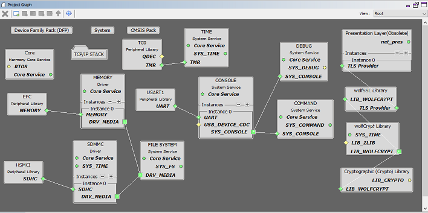
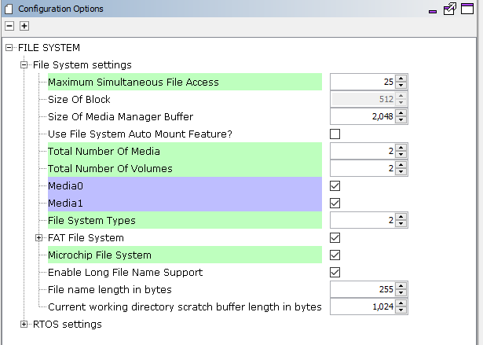
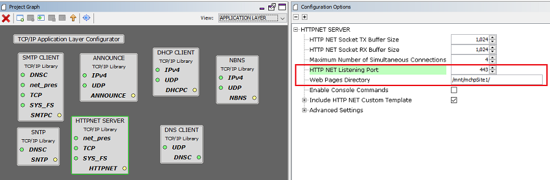
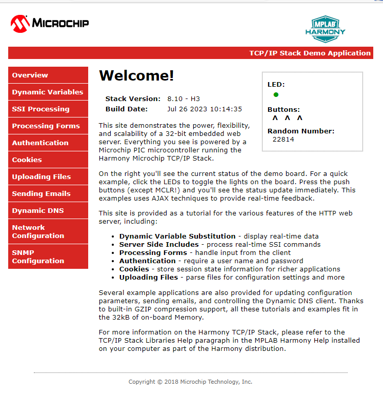

# TCP/IP WEB & FTP SERVER Application with MPFS & FATF FS

The Web and FTP Server configuration demonstrates creating an application where HTTP web server will use MPFS FS with NVM media and FTP server will use FAT FS with SDCARD as media.

The Non-Volatile Memory \(NVM\) Microchip Proprietary File System \(MPFS\) is used for storing the web pages in the internal Flash.

The FAT FS File System is used for storing any type of files and FTP server will read from and write to this FS.

**TCP/IP WEB-NET & FTP Server MHC Configuration**

The following Project Graph diagram shows the Harmony components included in the application demonstration.

-   MHC is launched by selecting **Tools \> Embedded \> MPLAB® Harmony 3 Configurator** from the MPLAB X IDE and after successful database migration , TCP/IP demo project is ready to be configured and regenerated.

    

-   **TCP/IP Root Layer Project Graph**

    The root layer project shows that UART2 peripheral is selected to do read and write operation for TCP/IP commands.

    This is the basic configuration with SYS\_CONSOLE, SYS\_DEBUG and SYS\_COMMAND modules. These modules are required for TCP/IP command execution.

    TCP/IP application with both MPFS and FAT FS access. The below root project graph depicts the use of more than FS by TCP/IP stack. Also HTTP Server use Wolfssl library to support secured web server on port. 443

    

    **WolfSSL** component is selected for secure connection which supports TLS v1.3 and **WolfSSL-Crypto** component is selected for MD5 and SHA authentication.

    

    Both MPFS and FAT File System Configuration -

    

    **FreeRTOS** component is required for RTOS application. For bare-metal \(non-RTOS\) **FreeRTOS** component should not be selected.

    TCP sockets calculate the ISN using the wolfSSL crypto library.

-   **TCP/IP Required Application**

    TCP/IP demo use these application module components for this demo.

    **Announce** module to discover the Microchip devices within a local network.

    **DHCP Client** module to discover the IPv4 address from the nearest DHCP Server.

    **HTTPNET** module is selected to run the web\_server for the secured port number **443**.

    **FTP SERVER** an application layer protocol that facilitates uploading of files to, and downloading of files from, an embedded device.

    

    -   HTTPNET server with Web directory Mount path and Security port number configuration:

        

        Http Server module use the NVM mount path with MPFS files system. Also HTTP server module use the secured port number 443.

    -   FTP server use the FAT FS to access files from SDCARD media.

        

-   **TCPIP Driver Layer**

    **Internal ethernet driver\(gmac\)** is enabled with the external **LAN8740 PHY driver** library for SAME70 demonstartion.

    

    For **SAM V71** demonstration , **LAN8061 PHY driver** ia selcted along with GMAC **Internal ethernet driver**.

    

    The MIIM Driver supports asynchronous read/write and scan operations for accessing the external PHY registers and notification when MIIM operations have completed.

**TCP/IP WEB-NET and FTP Server Hardware Configuration**

This is the section describes the hardware configuration for ATSAM E70/V71 Xplained Ultra Evaluation Kit and one can be used for the respective application demonstration.

1.  This section describes the required default hardware configuration use SAM E70 Xplained Ultra Evaluation Kit

    -   Ensure ERASE jumper is Open.

    -   Open the J805 Jumper

    -   Refer to the SAM E70/V71 Ethernet Starter Kit [User Guide](http://ww1.microchip.com/downloads/en/DeviceDoc/SAME70_Xplained_Ultra_Evaluation_User's%20Guide_DS70005389B.pdf)

        

    -   Insert the LAN8740 PHY daughter board on the ETHERNET PHY MODULE header.

    -   Connect the micro USB cable from the computer to the DEBUG USB connector on the SAM E70 Xplained Ultra Evaluation Kit

    -   Establish a connection between the router/switch with the SAM E70 Xplained Ultra Evaluation Kit through the RJ45 connector

        

2.  This section describes the required default hardware configuration use SAM V71 Xplained Ultra Evaluation Kit

    -   No hardware related configuration or jumper setting changes are necessary

    -   Ensure ERASE jumper is Open

    -   Refer to the SAM E70/V71 Ethernet Starter Kit [User Guide](http://ww1.microchip.com/downloads/en/DeviceDoc/Atmel-42408-SAMV71-Xplained-Ultra_User-Guide.pdf)

        

    -   Connect the micro USB cable from the computer to the DEBUG USB connector on the SAM V71 Xplained Ultra Evaluation Kit

    -   Establish a connection between the router/switch with the SAM V71 Xplained Ultra Evaluation Kit through the RJ45 connector

        

**TCP/IP WEB-NET & FTP SERVER Running Application**

This application uses more than one FS for the TCP/IP application demonstration. Here HTTP Net server uses Microchip Proprietary File System \(MPFS\) as a read only FS. Here MPFS FS reads web pages from Non-Volatile Memory \(NVM\) media which is used to store the web server pages.

The FAT FS File System read and writes to SDCard memory media which is used for storing any type of files. FTP server will read from and write to this SDcard media using FAT FS.

This table list the name and location of the MPLAB X IDE project folder for the demonstration.

|Project Name|Target Device|Target Development Board|Description|
|------------|-------------|------------------------|-----------|
|sam\_e70\_xult.X|ATSAME70Q21B|SAME70 Xplained Ultra + LAN8740 PHY Daughter board|Demonstrates the TCP/IP Web Server with more than one FS on a development board with ATSAME70Q21B device and LAN8740 PHY daughter board. This implementation is based on Bare Metal \( non-RTOS \).|
|sam\_e70\_xult\_freertos.X|ATSAME70Q21B|SAME70 Xplained Ultra + LAN8740 PHY Daughter board|Demonstrates the TCP/IP Web Server with more than one FS on a development board with ATSAME70Q21B device and LAN8740 PHY daughter board. This implementation is based on FreeRTOS.|

1.  Ensure a microSD/SD card is formatted and loaded with the web pages provided within the < install-dir \>/net/apps/web\_ftp\_server\_mpfs\_fatfs/firmware/src/web\_pages directory.

**Running Demonstration Steps**

1.  Build and download the demonstration project on the target board.

2.  If the board has a UART connection:

    1.  A virtual COM port will be detected on the computer, when the USB cable is connected to USB-UART connector.

    2.  Open a standard terminal application on the computer \(like Hyper-terminal or Tera Term\) and configure the virtual COM port.

    3.  Set the serial baud rate to 115200 baud in the terminal application.

    4.  See that the initialization prints on the serial port terminal.

    5.  When the DHCP client is enabled in the demonstration, wait for the DHCP server to assign an IP address for the development board. This will be printed on the serial port terminal.

        -   Alternatively: Use the Announce service or ping to get the IP address of the board.

        -   Run **tcpip\_discoverer.jar** to discover the IPv4 and IPv6 address for the board.

3.  HTTP Net Server Output -

    An HTTP server is hosted by the demonstration application. Open a web browser and direct it to the board running the HTTP server by typing the URL in the address bar \(for example, https://mchpboard\_c\), and then pressing Enter.

    The demonstration application features following:

    Real-time Hardware Control and Dynamic Variables - On the Overview page the LEDs can be clicked to toggle the LEDs on the Microchip hardware development board. The SWITCHes on the Microchip hardware development board can be pressed to toggle the Buttons on the web page. The dynamic variables can be updated in real-time on the HTTP server.

    **Note:** For the LED and SWITCH functionality portion of the demonstration, configure the GPIOs connected to LEDs and Switches on Microchip hardware development board, through the Pin Configuration manager in MPLAB® Harmony Configurator \(MHC\).

    1.  **Form Processing** - Input can be handled from the client by using the GET and POST methods \(this functionality controls the on-board LEDs and is operational only on the Explorer 16 Development Board\)

    2.  **Authentication** - Shows an example of the commonly used restricted access feature

    3.  **Cookies** - Shows an example of storing small text strings on the client side

    4.  **Server Side Includes** - An example of how SSI can be used to support dynamic content

    5.  **File Uploads** - Shows an example of a file upload using the POST method. The HTTP server can\_accept\_a user-defined MPFS/MPFS2 image file for web pages.

    6.  **Send E-mail** - Shows simple SMTP POST methods

    7.  **Dynamic DNS** - Exercises Dynamic DNS capabilities

    8.  **Network Configuration** - The MAC address, host name, and IP address of the evaluation kit can be viewed in the Network Configuration page and some configurations can be updated

    9.  **MPFS Upload** - A new set of web pages can be uploaded to the web server using this feature, which is accessed through http://mchpboard\_c/mpfsupload

    **Notes:** The location of the MPFS image is fixed at the beginning of the Flash page specified by DRV\_MEMORY\_DEVICE\_START\_ADDRESS. The size of the MPFS upload is limited to DRV\_MEMORY\_DEVICE\_MEDIA\_SIZE in the demonstration. The HTTP File Upload functionality has to be enabled when the project is generated.

    

4.  FTP Server output -

    Also to transfer file , FTP output –

    Open windows command console and enter FTP server IP address \(here FTP server IP address - 192.168.100.11\) to access the FTP SERVER

    |FTP OUTPUT|
    |----------|
    |C:\>ftp 192.168.100.11|
    |Connected to 192.168.100.11.|
    |220 Ready|
    |User \(192.168.100.11:\(none\)\): Microchip|
    |331 Password required|
    |Password:|
    |230 Logged in|
    |ftp\> pwd|
    |257 "/" is cwd|
    |ftp\> dir|
    |200 Command Ok|
    |125 File status okay; about to open data connection|
    |-rwx------ 0 0 0 36 Aug 09 2013 file.txt|
    |-rwx------ 0 0 0 12 Aug 09 2013 file1.txt|
    |drwx------ 0 0 0 0 Feb 25 2019 System Volume Information|
    |-rwx------ 0 0 0 24 Aug 09 2013 file\_hs.txt|
    |-rwx------ 0 0 0 12 Aug 09 2013 file\_hs3.txt|
    |-rwx------ 0 0 0 468 Aug 09 2013 file\_hs5.txt|
    |-rwx------ 0 0 0 42077 Aug 09 2013 Presentation1.pptx|
    |drwx------ 0 0 0 0 Jul 16 2019 ATE\_EtherCAT\_Demo|
    |-rwx------ 0 0 0 9287357 Jul 17 2019 ATE\_EtherCAT\_Demo.7z|
    |drwx------ 0 0 0 0 Jul 17 2019 Dell\_Laptop\_bakcup|
    |-rwx------ 0 0 0 979594 Dec 03 2019 IoT Demo.pptx|
    |drwx------ 0 0 0 0 Dec 10 2019 wifi\_rgb\_easy\_configuration|
    |drwx------ 0 0 0 0 Nov 14 2019 wireless|
    |drwx------ 0 0 0 0 Nov 26 2019 test\_bypass\_http\_net\_server|
    |-rwx------ 0 0 0 8186726 Nov 27 2019 test\_bypass\_http\_server\_1.zip|
    |drwx------ 0 0 0 0 Jan 30 2020 FOE\_BinFIle|
    |drwx------ 0 0 0 0 Jan 31 2020 FoE\_Hex\_imagefiles|
    |drwx------ 0 0 0 0 Mar 16 2020 exam|
    |drwx------ 0 0 0 0 Jun 02 2020 webpages|
    |-rwx------ 0 0 0 525 Jun 09 2020 New Volume \(D\) - Shortcut.lnk|
    |226 Closing data connection. Requested file action successful.|
    |ftp: 1424 bytes received in 0.20Seconds 7.19Kbytes/sec.|
    |ftp\> cd webpages|
    |250 /webpages/ is new cwd|
    |ftp\> dir|
    |200 Command Ok|
    |125 File status okay; about to open data connection|
    |drwx------ 0 0 0 0 Jun 02 2020 dyndns|
    |drwx------ 0 0 0 0 Jun 02 2020 email|
    |drwx------ 0 0 0 0 Jun 02 2020 protect|
    |drwx------ 0 0 0 0 Jun 02 2020 snmp|
    |-rwx------ 0 0 0 1388 May 03 2019 auth.htm|
    |-rwx------ 0 0 0 2104 Feb 11 2020 cookies.htm|
    |-rwx------ 0 0 0 1986 Feb 11 2020 dynvars.htm|
    |-rwx------ 0 0 0 161 Feb 11 2020 footer.htm|
    |-rwx------ 0 0 0 2068 Feb 11 2020 forms.htm|
    |-rwx------ 0 0 0 2150 Feb 11 2020 harmony.gif|
    |-rwx------ 0 0 0 1232 Feb 11 2020 header.htm|
    |-rwx------ 0 0 0 3798 Feb 11 2020 index.htm|
    |-rwx------ 0 0 0 21 Feb 11 2020 leds.cgi|
    |-rwx------ 0 0 0 3183 Feb 11 2020 mchp.css|
    |-rwx------ 0 0 0 1263 Feb 11 2020 mchp.gif|
    |-rwx------ 0 0 0 3721 Feb 11 2020 mchp.js|
    |-rwx------ 0 0 0 512 Feb 11 2020 snmp.bib|
    |-rwx------ 0 0 0 2032 Feb 11 2020 ssi.htm|
    |-rwx------ 0 0 0 183 Feb 11 2020 status.xml|
    |-rwx------ 0 0 0 970 Feb 11 2020 upload.htm|
    |226 Closing data connection. Requested file action successful.|
    |ftp: 1267 bytes received in 0.17Seconds 7.45Kbytes/sec.|
    |ftp\> get mchp.css|
    |200 Command Ok|
    |150 File status okay; about to open data connection|
    |226 Transfer Complete|
    |ftp: 3183 bytes received in 1.42Seconds 2.24Kbytes/sec.|
    |ftp\> put ActivityLog.xml|
    |200 Command Ok|
    |150 File status okay; about to open data connection|
    |226 Transfer Complete|
    |ftp: 86262 bytes sent in 0.56Seconds 152.68Kbytes/sec.|
    |ftp\> ls|
    |200 Command Ok|
    |125 File status okay; about to open data connection|
    |Date Type FileSize filename|
    |05-03-2019 11:54:24 file 1388 auth.htm|
    |02-11-2020 16:47:38 file 2104 cookies.htm|
    |02-11-2020 16:47:38 file 1986 dynvars.htm|
    |02-11-2020 16:47:38 file 161 footer.htm|
    |02-11-2020 16:47:40 file 2068 forms.htm|
    |02-11-2020 16:47:40 file 2150 harmony.gif|
    |02-11-2020 16:47:40 file 1232 header.htm|
    |02-11-2020 16:47:40 file 3798 index.htm|
    |02-11-2020 16:47:42 file 21 leds.cgi|
    |02-11-2020 16:47:42 file 3183 mchp.css|
    |02-11-2020 16:47:42 file 1263 mchp.gif|
    |02-11-2020 16:47:42 file 3721 mchp.js|
    |02-11-2020 16:47:44 file 512 snmp.bib|
    |02-11-2020 16:47:46 file 2032 ssi.htm|
    |02-11-2020 16:47:46 file 183 status.xml|
    |02-11-2020 16:47:46 file 970 upload.htm|
    |08-09-2013 15:06:00 file 86262 ActivityLog.xml|
    |226 Closing data connection. Requested file action successful.|
    |ftp: 799 bytes received in 0.16Seconds 4.99Kbytes/sec.|
    |ftp\>|

**Parent topic:**[MPLAB® Harmony 3 TCP/IP Application for SAM E70/V71 Family](GUID-1B418433-257B-421A-B251-3443D46108F8.md)

